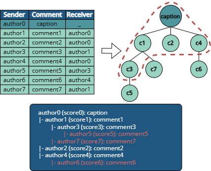
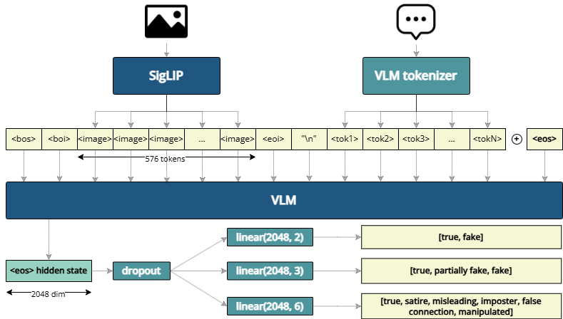

# LVLM-Fake-Posts-Detection

A deep learning project for fake post detection using Large Vision-Language Models (LVLMs).

## Overview

The spread of misinformation across online social networks poses a growing challenge due to the multimodal and interactive nature of user-generated content. In this work, we propose a lightweight yet effective approach for detecting fake posts by leveraging a fine-tuned Large Vision-Language Model (LVLM). We hypothesize that misinformation cues are encoded, not only in the post’s image and caption, but also in the surrounding context: the discourse around content will inevitably help inform about the truthfulness of any piece of media. We interpret discourse with a graph-based technique that transforms nested comment threads into structured text, including author metadata and engagement scores. This sequence, combined with visual input, is processed by a compact LVLM using a \textit{LoRA} fine-tuned adapter. We evaluate our approach on the \textit{Fakeddit} benchmark and achieve state-of-the-art results across all classification tasks: 97.16\% accuracy for 2-way, 97.05\% for 3-way, and 93.72\% for 6-way classification, using a quarter of the training samples. These findings demonstrate that large-scale multimodal pretraining, combined with lightweight adaptation and structured social context, offers a powerful and scalable framework for misinformation detection in real-world settings.

## Project Structure

```
├── src/                  # Source code
│   ├── adapters.py       # Model adapters
│   ├── callbacks.py      # Training callbacks
│   ├── collators.py      # Data collation utilities
│   ├── config.py         # Configuration handling
│   ├── constants.py      # Project constants
│   ├── datamodules.py    # PyTorch Lightning data modules
│   ├── datasets.py       # Dataset implementations
│   ├── loggers.py        # Logging utilities
│   ├── models.py         # Model architectures
│   ├── modules.py        # PyTorch Lightning modules
│   ├── optimizers.py     # Optimizer implementations
│   └── utils.py          # Utility functions
├── train.py              # Main training script
├── LICENSE               # CC0 1.0 Universal License
└── README.md             # This file
```

## Installation

```bash
# Clone the repository
git clone https://github.com/adgiz05/LVLM-fake-posts-detection.git
cd LVLM-fake-posts-detection

# Set up a virtual environment
python -m venv venv
source venv/bin/activate  # On Windows: venv\Scripts\activate

# Install dependencies
pip install -r requirements.txt  # Create this file with your dependencies
```

## Usage

To train a model:

```bash
python train.py --project project_name --run run_name --devices 0
```

Arguments:
- `--project`: Project name for organizing experiments
- `--run`: Run name for the specific experiment
- `--devices`: GPU device ID to use (optional)

## Data Visualization

Below is an example of the data processing pipeline visualized:



We convert OSN comments into a graph and prune it for avoiding huge contexts. Then, we convert it directly into text for the VLLM input.

## Model Architecture

The system utilizes a VLLM (Vision-Language Learning Model) architecture that combines:
- Vision encoders for image content
- Text encoders for post titles and comments
- Graph neural networks for comment structure analysis



## License

This project is licensed under CC0 1.0 Universal - see the LICENSE file for details.

From the publication _Discourse matters: In-context multimodal fake content detection using Large Vision-Language Models_.

## Models and Modules

### VLLM Classifier Module

The core of the system is the `VLLMClassifierModule`, which:
- Integrates vision and language encoders
- Implements training, validation, and test loops
- Handles optimization and metrics calculation

### Data Module

The `VLLMDataModule` handles:
- Data loading and preprocessing
- Batch creation with appropriate collation
- Train/val/test dataset preparation

### Callbacks and Logging

The project uses PyTorch Lightning callbacks and loggers:

- Model checkpointing
- Early stopping
- Learning rate monitoring
- WandB integration for experiment tracking

### Performance

The model can be evaluated using:
- Accuracy
- F1 Score
- Precision
- Recall

<!-- ## Citation

If you use this code for your research, please cite:

```
@software{LVLM-fake-posts-detection,
  author = {Your Name},
  title = {LVLM-Fake-Posts-Detection},
  year = {2025},
  url = {https://github.com/yourusername/LVLM-fake-posts-detection}
}
``` -->

## Acknowledgements

This work has been supported by the following projects: H2020 TMA-MSCA-DN TUAI project "Towards an Understanding of Artificial Intelligence via a transparent, open and explainable perspective" (HORIZON-MSCA-2023-DN-01-01, Grant agreement nº: 101168344); by Strategic Networking and Development Program funded by the Ministry of Science and ICT through the National Research Foundation of Korea (RS-2023-00267476); by project PCI2022-134990-2 (MARTINI) of the CHISTERA IV Cofund 2021 program; by European Comission under IBERIFIER Plus - Iberian Digital Media Observatory (DIGITAL-2023-DEPLOY- 04-EDMO-HUBS 101158511); by EMIF managed by the Calouste Gulbenkian Foundation, in the project MuseAI; and by Comunidad Autonoma de Madrid, CIRMA-CAM Project (TEC-2024/COM-404).